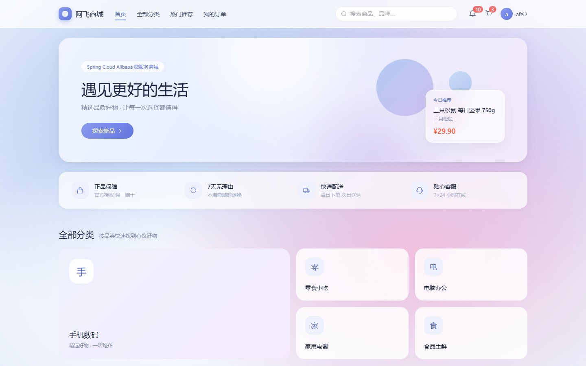
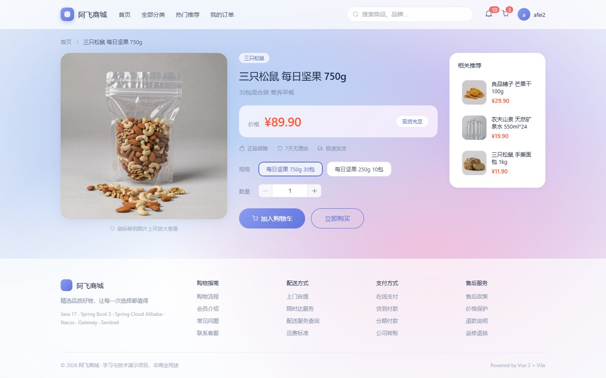
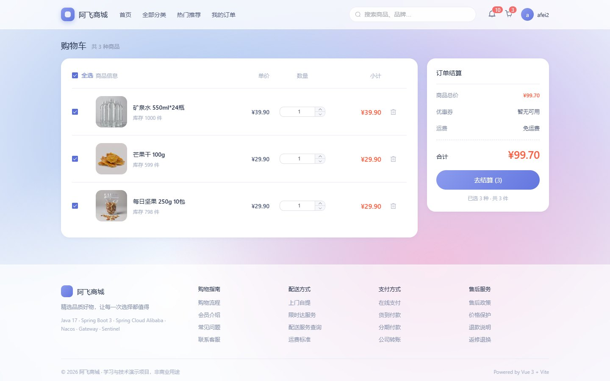
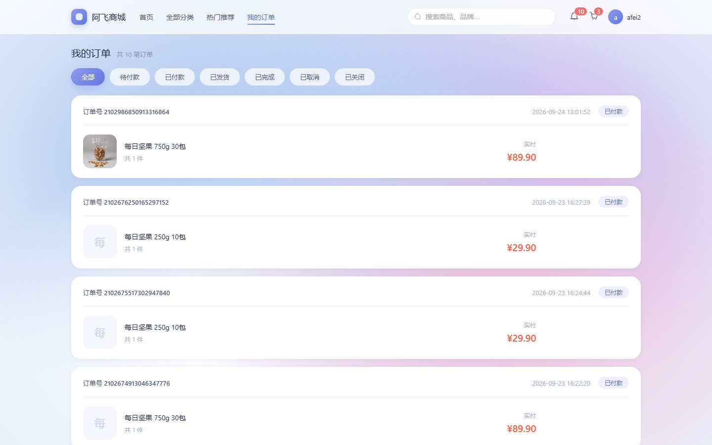
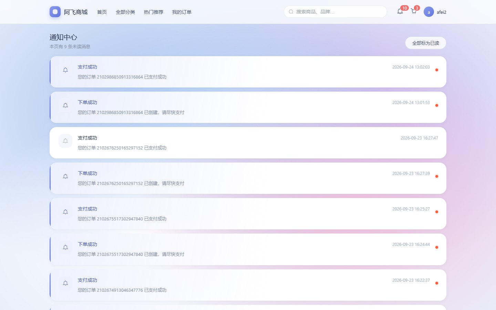
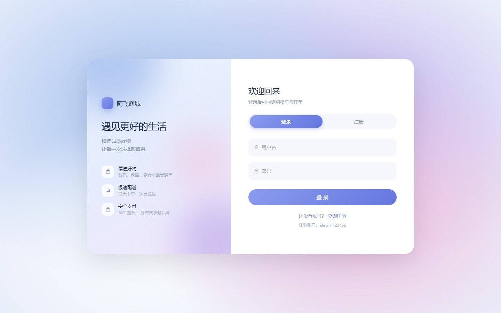

# 阿飞商城 · 前端

基于 **Vue 3 + Vite + Element Plus** 的电商商城前台，配套后端为 Spring Cloud Alibaba 微服务项目 [afei-mall](https://github.com/29af29/af-mall)。

前后端分离部署，通过 API 网关（`localhost:8000`）以 REST 接口通信，覆盖「浏览商品 → 加入购物车 → 确认订单 → 支付 → 查看订单」的完整购物闭环。

## 界面预览

| 首页 | 商品详情 | 购物车 |
| :--: | :--: | :--: |
|  |  |  |

| 我的订单 | 通知中心 | 登录 / 注册 |
| :--: | :--: | :--: |
|  |  |  |

> 以上为本地运行的实际界面截图，商品图托管于阿里云 OSS。

## 技术栈

| 分类 | 选型 |
| --- | --- |
| 框架 | Vue 3.5（Composition API + `<script setup>`） |
| 构建工具 | Vite 5 |
| 状态管理 | Pinia 2 |
| 路由 | Vue Router 4（history 模式 + 全局路由守卫） |
| UI 组件库 | Element Plus 2.8 |
| HTTP 客户端 | axios（统一请求/响应拦截器） |

## 功能模块

| 页面 | 路由 | 说明 |
| --- | --- | --- |
| 首页 | `/` | Hero 横幅、服务保障、Bento 分类导航、商品推荐（分页 + 搜索） |
| 登录 / 注册 | `/login` | 全屏分栏布局，滑块切换登录与注册 |
| 商品详情 | `/goods/:id` | 主图、SKU 规格选择（含缺货态）、数量、加购 / 立即购买、相关推荐 |
| 购物车 | `/cart` | 商品勾选、数量增减、删除，右侧实时结算面板 |
| 确认订单 | `/order/confirm` | 收货信息表单、商品清单、费用明细 |
| 我的订单 | `/order` | 状态筛选、订单卡片、去支付 / 取消订单 |
| 通知中心 | `/notify` | 未读高亮、单条已读、全部已读 |

## 项目结构

```
src/
├── api/
│   ├── index.js          # 按模块聚合的接口定义（auth/user/product/search/cart/order/pay/notify）
│   └── request.js        # axios 实例 + 拦截器（自动注入 token、统一处理 Result）
├── assets/styles/
│   └── index.css         # 设计系统：设计 Token、极光背景、玻璃拟态、动效基础类
├── components/
│   ├── AppFooter.vue     # 页脚
│   ├── CountUp.vue       # 金额数字滚动
│   ├── NavBar.vue        # 吸顶导航（玻璃拟态、滚动收缩、角标）
│   ├── ProductCard.vue   # 商品卡片（光斑跟随、加购飞入）
│   └── SectionHeader.vue # 区块标题
├── directives/
│   └── reveal.js         # v-reveal 滚动渐入指令
├── router/index.js       # 路由表、守卫、锚点滚动
├── store/user.js         # 用户状态（token / 用户信息）
├── utils/
│   ├── animation.js      # 加购飞入购物车动画
│   └── format.js         # 金额、时间、订单状态格式化
├── views/                # 页面组件
├── App.vue               # 全局布局（可切换 blank 布局）
└── main.js               # 应用入口
```

## 设计说明

全站采用统一的视觉语言：

- **配色**：品牌蓝紫 `#5b6fd8`，促销强调色 `#ff5a3c`，全部通过 CSS 变量管理，改 `--brand-*` 即可整体换色
- **背景**：双层光斑组成的极光渐变，缓慢漂移并跟随鼠标轻微视差
- **玻璃拟态**：导航栏与悬浮卡片使用 `backdrop-filter` 半透明质感
- **动效原则**：仅使用 `transform` / `opacity`（走 GPU 合成），并统一提供 `prefers-reduced-motion` 降级

自研的动效实现（未引入额外依赖）：

- `v-reveal` —— 基于 `IntersectionObserver` 的滚动渐入，支持传入延迟做错峰
- `CountUp` —— `requestAnimationFrame` + easeOutCubic 的金额滚动
- `flyToCart` —— Web Animations API 实现的抛物线加购动画

## 快速开始

### 环境要求

- Node.js >= 18
- 后端服务已启动（网关监听 `8000` 端口）

### 安装与运行

```bash
# 安装依赖
npm install

# 启动开发服务器（默认 5173 端口）
npm run dev

# 生产构建
npm run build

# 预览构建产物
npm run preview
```

### 接口代理

开发环境通过 Vite 代理转发到网关，无需额外配置跨域：

```js
// vite.config.js
server: {
  proxy: {
    '/api': {
      target: 'http://localhost:8000',
      changeOrigin: true
    }
  }
}
```

### 测试账号

```
用户名：afei2
密码：123456
```

## 约定说明

- 后端统一响应体为 `{ code, message, data }`，`code === 200` 表示业务成功，由响应拦截器统一解包
- 登录后 token 存放于 `localStorage`，请求时自动附加 `Authorization: Bearer <token>`
- 需要登录的页面通过路由 `meta.requiresAuth` 声明，未登录会重定向到登录页并携带 `redirect` 参数
- 全屏页面（如登录页）通过路由 `meta.blank` 声明，会自动隐藏导航栏与页脚

## License

本项目仅用于学习与技术演示，非商业用途。
